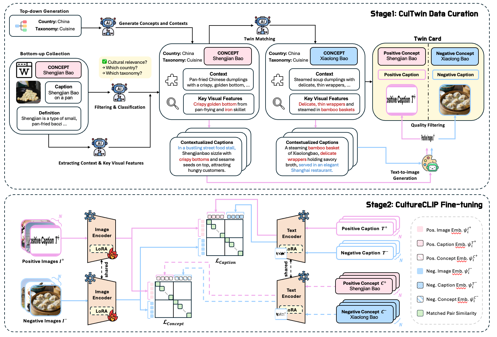

<div align="center">

# CultureCLIP: Empowering CLIP with Cultural Awareness through Synthetic Images and Contextualized Captions

</div>

<!-- <div align="center">
<b><a href="https://scholar.google.com/citations?user=ULvoYXgAAAAJ&hl=zh-CN" target="_blank">Zhitao He</a><sup>1</sup> <a href="https://github.com/Zhitao-He/MMBoundary" target="_blank"> Sandeep Polisetty</a><sup>1,2</sup> <a href="https://zhiyuan.fan/" target="_blank">Zhiyuan Fan</a><sup>1</sup> <a href="https://lukahhcm.github.io/" target="_blank"> Yuchen Huang</a><sup>1</sup> <a href="https://shujinwu-0814.github.io/" target="_blank"> Shujin Wu</a><sup>1,3</sup> <a href="https://mayrfung.github.io/" target="_blank">Yi R. (May) Fung</a><sup>1</sup></b>


<sup>1 </sup>HKUST &nbsp; <sup>2 </sup> UMass Amherst &nbsp; <sup>3 </sup>USC

[](https://arxiv.org/abs/2505.23224)
[](https://huggingface.co/datasets/Zhitao-He/MMBoundary)

</div>

<br>

## News

- **2025/05/15:** 🔥 **MMBoundary** is accepted to ACL 2025 Main Conference!

--- -->

## Introduction

Pretrained vision-language models (VLMs) such as CLIP excel in multimodal understanding but struggle with contextually relevant fine-grained visual features, making it difficult to distinguish visually similar yet culturally distinct concepts. This limitation stems from the scarcity of high-quality culture-specific datasets, the lack of integrated contextual knowledge, and the absence of hard negatives highlighting subtle distinctions. To address these challenges, we first design a data curation pipeline that leverages open-sourced VLMs and text-to-image diffusion models to construct **CulTwin**, a synthetic cultural dataset. This dataset consists of paired concept-caption-image triplets, where concepts visually resemble each other but represent different cultural contexts. Then, we fine-tune CLIP on CulTwin to create **CultureCLIP**, which aligns cultural concepts with contextually enhanced captions and synthetic images through customized contrastive learning, enabling finer cultural differentiation while preserving generalization capabilities. Experiments on culturally relevant benchmarks show that CultureCLIP outperforms the base CLIP, achieving a notable 5.49% improvement in fine-grained concept recognition on specific tasks, while preserving CLIP's original generalization ability, validating the effectiveness of our synthetic dataset and training paradigm in capturing subtle cultural distinctions.

<div align="center">
<h3>CultureCLIP Overview</h3>

</div>


## Code Structure

```
CultureCLIP/
├── data_curation/           # Data preparation
│   ├── bottom_up/          # Bottom-up concept collection (Section 3.1)
│   │   ├── filter.py      # Filter raw data for concept mining
│   │   └── classification.py  # Classify concepts from filtered data
│   │
│   ├── top_down/          # Top-down concept generation (Section 3.1)
│   │   ├── country_taxonomy.py  # Generate country-category pairs
│   │   └── concept_generation.py  # Generate concept pairs
│   │
│   ├── twin_matching.py    # Match twin concepts (Section 3.1)
│   │
│   ├── diverse_caption.py  # Generate diverse captions (Section 3.2)
│   │
│   └──  image_generation/   # Image synthesis and quality filtering (Section 3.3)
│       ├── image_gen.py    # Generate images using diffusion models
│       └── quality_check.py  # Filter generated images
│  
├── model_finetune/         # Model training and fine-tuning (Section 4)
│   ├── run_clip_lora.py    # Main training script with LoRA support
│   ├── run_clip_lora.sh    # Training script launcher
│   ├── data.py            # Data loading and processing
│   └── loss.py            # Custom loss functions
│
└── evaluation/            # Evaluation scripts
    ├── benchmark_GlobalRG_Retrieval.py  # Global retrieval evaluation
    ├── benchmark_GlobalRG_Grounding.py  # Grounding evaluation
    └── benchmark_CROPE.py              # CROPE benchmark evaluation
```

## Installation

- Clone the repository:
```bash
git clone https://github.com/lukahhcm/CultureCLIP.git
cd CultureCLIP
```

- Create a connda environment:
```bash
conda create -n CultureCLIP python=3.9
conda activate CultureCLIP
pip install -r requirements.txt
```

## Usage

### 1. Data Preparation

The data curation pipeline consists of three main steps:

#### Step 1: Concept Mining and Twin Matching (Section 3.1)

- Bottom-up Collection:
```bash
# Filter raw data
python data_curation/bottom_up/filter.py
# Classify concepts
python data_curation/bottom_up/classification.py
```

- Top-down Generation:
```bash
# Generate country-category pairs
python data_curation/top_down/country_taxonomy.py

# Generate concepts
python data_curation/top_down/concept_generation.py
```

- Twin matching:
```bash
python data_curation/twin_matching.py
```

#### Step 2: Diverse Caption Generation (Section 3.2)

- Generate diverse captions for the twin pairs:
```bash
python data_curation/diverse_caption.py
```

#### Step 3: Image Synthesis and Quality Filtering (Section 3.3)

- Generate images from captions:
```bash
bash data_curation/image_generation/run.sh
```

- Filter generated images for quality:
```bash
python data_curation/image_generation/quality_check.py
```

### 2. Model Training

To fine-tune the model using LoRA:

```bash
bash model_finetune/run_clip_lora.sh
```

Key training parameters:
- `--model_name_or_path`: Base CLIP model to use
- `--use_lora`: Enable LoRA fine-tuning
- `--loss_type`: Choose from various loss functions:
  - `cultureclip`: Full CultureCLIP loss
  - `clip`: Standard CLIP loss
  - `caption_clip`: Caption-only CLIP loss
  - `concept_clip`: Concept-only CLIP loss
  - And more...

### 3. Evaluation

Run different evaluation benchmarks:

```bash
# GlobalRG Retrieval Evaluation
python evaluation/benchmark_GlobalRG_Retrieval.py --model_path your_model_path

# GlobalRG Grounding Evaluation
python evaluation/benchmark_GlobalRG_Grounding.py --model_path your_model_path

# CROPE Benchmark
python evaluation/benchmark_CROPE.py --model_path your_model_path
```

<!-- ## Citation

If you use this code in your research, please cite:

```bibtex
@inproceedings{cultureclip2025,
  title={Empowering CLIP with Cultural Awareness through Synthetic Images and Contextualized Captions},
  author={Your Name},
  booktitle={Conference on Language Modeling (COLM)},
  year={2025}
}
``` -->

## License

**Code:** Licensed under the [Apache 2.0 License](LICENSE).
 **Dataset:** Licensed under the [CC BY-NC 4.0 License](https://creativecommons.org/licenses/by-nc/4.0/).
 
## Acknowledgments  
We would like to thank the following open-source projects for their contributions:  [HuggingFace Official CLIP Training Codes](https://github.com/huggingface/transformers/tree/main/examples/pytorch/contrastive-image-text).
